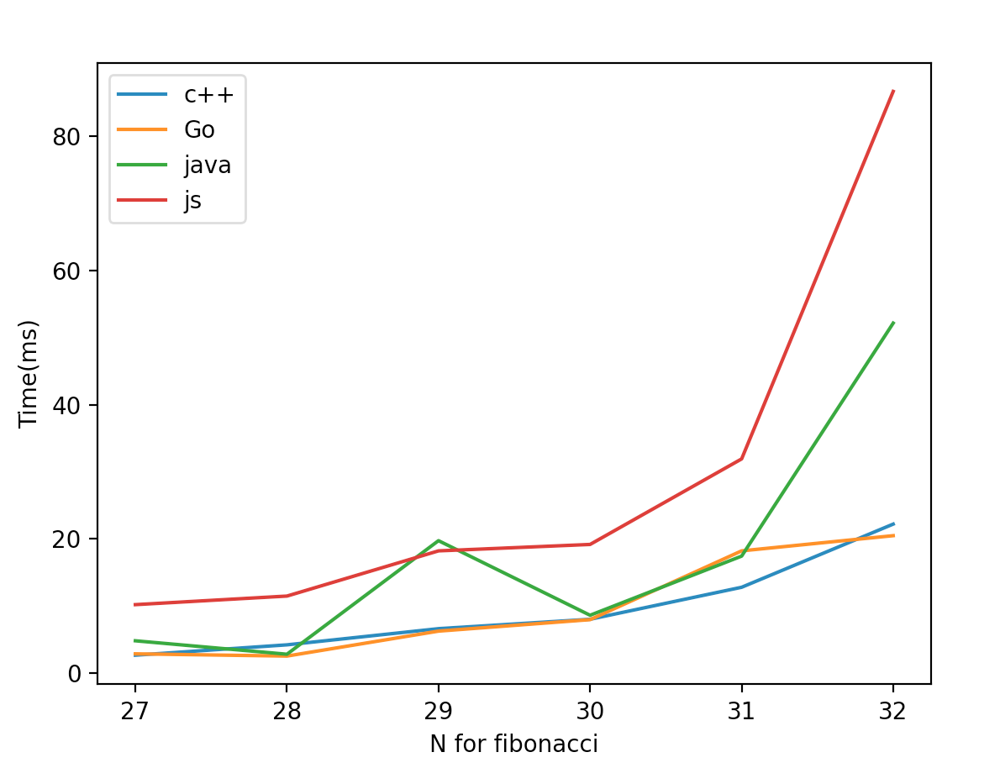

### `Exponential run-time for fib time analysis in multiple languages`





### `./run.sh > result.txt`
### `python3 plot.py`

### LinkedList vs ArrayList vs Array

### Hash
- [Two Sum 1] (./Hash/TwoSum/Solution.java)

### Stack
- [ValidParentheses 20] (./Stack/ValidParentheses/Solution.java)

### Notes
```
character space (1-26) is constant space
String s -> s.toCharArray() || s.charAt(index)
memo.put(c, memo.getOrDefault(c, 0) + 1);
memo.put('c') instead of memo.put("(");
```

